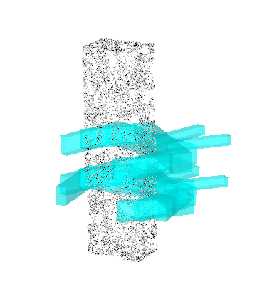

# Python binding for Grasp Pose Generator (pyGPG)
[](https://zenodo.org/badge/latestdoi/399418729)

[Grasp Pose Generator](https://github.com/atenpas/gpg.git) is a cpp package that creat grasp candidates for 3D point clouds.
This package binding it with python.

## Install in conda environment

```bash
conda install -c conda-forge pcl cmake boost
./build_pygpg.sh
```
- Note, if the conda failed to find the correct package to install, you can try installing [mamba](https://github.com/conda-forge/miniforge) and using mamba to install the dependencies: `mamba install pcl cmake boost`

## Example:
```python
import numpy as np
import pygpg

points = np.random.rand(3000, 3)  # put your point cloud here, should be a nX3 numpy array, here is an example random array
num_samples = 10000
show_grasp = False
gripper_config_file = "PATH_TO_GRIPPER_CONFIG_FILE"  # see gripper_params.cfg for an example
grasps = pygpg.generate_grasps(points, num_samples, show_grasp, gripper_config_file)
# grasps is a list of grasp objet, to construct a Transformation matrix from each grasp object, use:
pose_list = []
for grasp in grasps:
    pose = np.eye(4)
    pose[:3, 0] = grasp.get_grasp_approach()
    pose[:3, 1] = grasp.get_grasp_binormal()
    pose[:3, 2] = grasp.get_grasp_axis()
    pose[:3, 3] = grasp.get_grasp_bottom()
    pose_list.append(pose)
```

## Demo with a simple box:
```bash
python example/example.py
```
Press `R` to see the result:


## Citation
If you found pyGPG useful in your research, please consider citing:
```
@software{pygpg,
  author       = {Hongzhuo Liang},
  title        = {Python binding for Grasp Pose Generator (pyGPG)},
  month        = Aug,
  year         = 2021,
  doi          = {10.5281/zenodo.5247189},
  url          = {https://doi.org/10.5281/zenodo.5247189}
}
```
